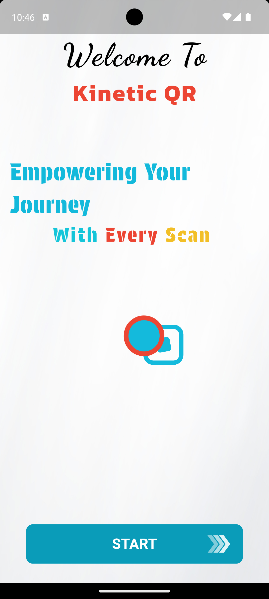
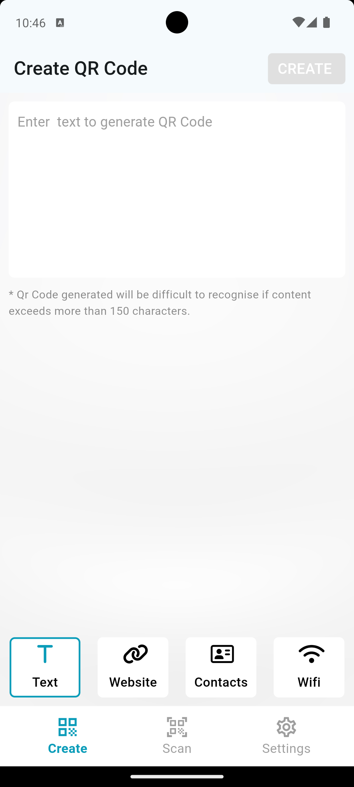
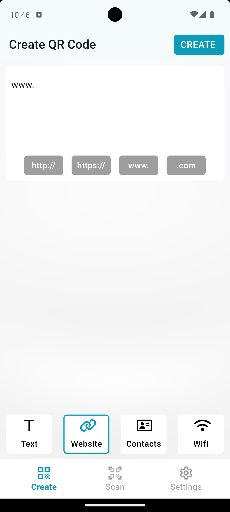
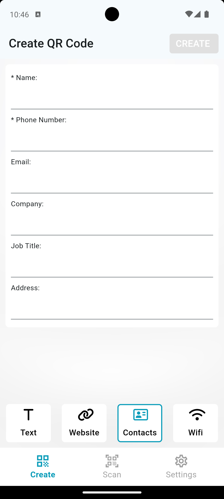
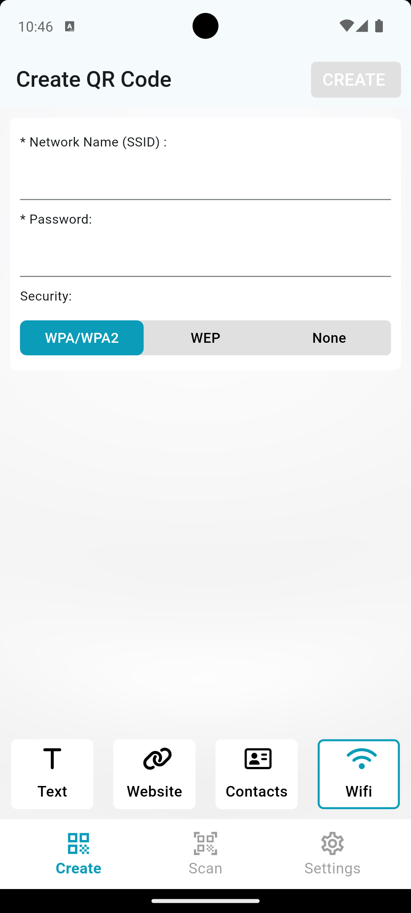
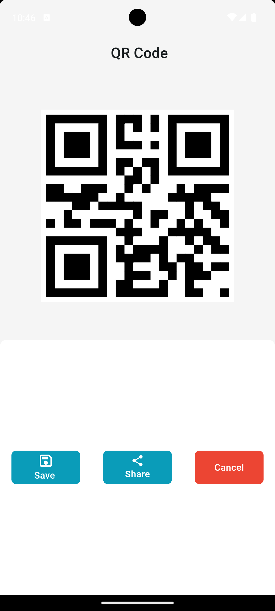
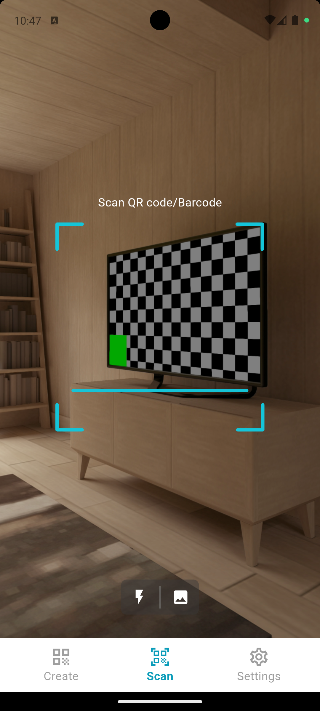
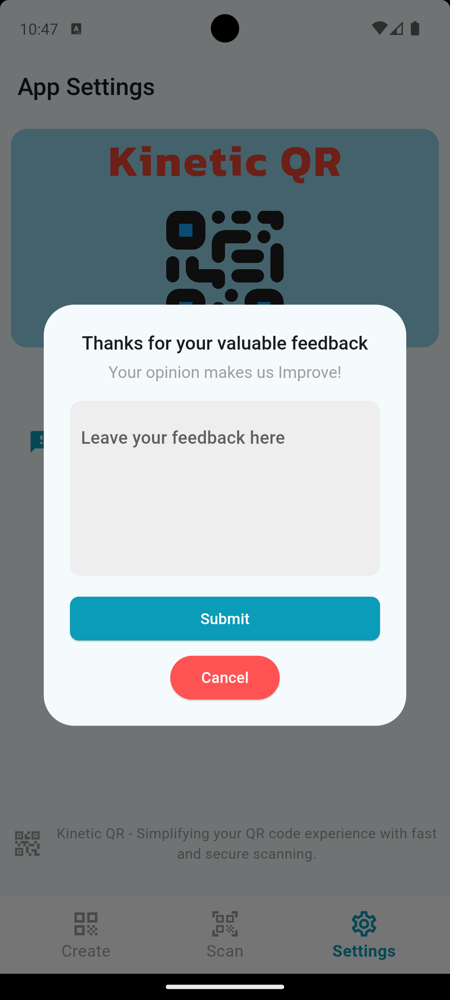

# Kinetic QR

Kinetic QR is a Flutter application that allows users to create and scan QR codes with ease. The app provides various functionalities for generating QR codes from different data types and  scanning QR codes using the device camera. 

## Features

### 1. QR Code Creation
- **Text QR Codes**: Create QR codes from text input.
- **Website (URLs) QR Codes**: Generate QR codes for URLs and websites.
- **Contact Info QR Codes**: Create QR codes for contact information (e.g., name, phone number, email).
- **Wi-Fi QR Codes**: Generate QR codes for Wi-Fi credentials, making it easy to share network access.

Once a QR code is created, the user can:
- **Save the QR Code**: Save the generated QR code directly to the device gallery.
- **Share the QR Code**: Share the QR code through various social media platforms and other apps.

### 2. QR Code Scanning
- **Camera Scanning**: Use the device’s camera to scan QR codes. The result is automatically displayed once detected.
- **Flashlight Support**: Enable the device flashlight for scanning in low-light conditions.
- **Gallery Scanning**: Scan QR codes saved in the device gallery by selecting the gallery icon.

### 3. Settings
- **Feedback and Support**: Submit feedback or ask for support via email directly from the app.

## State Management
- The application uses the **Provider** package for state management, ensuring a smooth and responsive user experience.

## Project Structure

The `lib` folder is organized into the following subfolders:

1. **providers**
   - Contains provider model classes used for managing the application state.
  
2. **router**
   - Contains routing logic, including route constants (names for each screen) and the `generateRoute` function to navigate between screens.

3. **screens**
   - Contains a folder for each screen of the app, and within each screen folder, a `widget` subfolder holds the widgets associated with that screen.

4. **services**
   - Contains service files, such as those for managing shared preferences, handling data storage etc. 

5. **utils**
   - Contains utility files, such as assets and other helper functions used throughout the app.

## Installation

To run this project locally:

1. **Clone the repository:**
   ```bash
   git clone https://github.com/aflah3100/kinetic_qr.git
   cd kinetic_qr
   
2. **Install dependencies**:
   ```bash
   flutter pub get

3. **Run the Application**:
   ```bash
   flutter run


## Screenshots

<table>
  <tr>
    <td>
      
      <p align="center"><b>Welcome Screen</b></p>
    </td>
    <td>
      
      <p align="center"><b>Text Qr Code Generation Screen</b></p>
    </td>
    <td>
      
      <p align="center"><b>Website QR code Generation Screen</b></p>
    </td>
  </tr>
   <tr><td colspan="3"><hr style="margin: 20px 0;"></td></tr>

  <tr>
    <td>
      
      <p align="center"><b>Contacts QR Code Generation Screen</b></p>
    </td>
    <td>
      
      <p align="center"><b>Wifi QR Code Generation Screen</b></p>
    </td>
    <td>
      
      <p align="center"><b>QR Code Display Screen</b></p>
    </td>
  </tr>
  <tr><td colspan="3"><hr style="margin: 20px 0;"></td></tr>

  <tr>
    <td>
      
      <p align="center"><b>Scanning QR Code</b></p>
    </td>
    <td>
      
      <p align="center"><b>Feedback</b></p>
    </td>
  </tr>
</table>

## Demo

<p align="center">
  <a href="https://drive.google.com/file/d/1W9AGtDviCWOjY-FSvaV0itSBGZTO5bG9/view?usp=sharing" target="_blank">
    
  </a>
</p>

Click the image above to watch the demo video.

